# 股票分析系統 - 架構藍圖 v2

> **版本記錄**: v2 整合 Worker 分離、回測模組、集保籌碼、產業鏈關聯表、TWSE 速率限制處理

## 一、系統概述

本系統為一套整合量化交易與系統化投資的股票分析平台，涵蓋盤前/盤中/盤後三大時間軸，結合技術面、籌碼面、消息面與情緒面四大分析維度，提供個人化的持股管理與決策支援。

## 二、技術架構

### 2.1 技術選型

| 層級 | 技術 | 說明 |
|------|------|------|
| 前端框架 | Next.js 16+ (App Router + Turbopack) | React 生態系，SSR/SSG 支援 |
| 前端圖表 | Recharts | K線圖、雷達圖、量價分析 |
| 狀態管理 | @tanstack/react-query | 伺服器狀態管理 + 快取 |
| 後端框架 | Python FastAPI | 非同步處理，低延遲 |
| 資料庫 | PostgreSQL + TimescaleDB | 關聯數據 + 時間序列 |
| 認證 | JWT + OAuth2 | 無狀態認證 |
| 即時通訊 | WebSocket (FastAPI) | 盤中即時推送 |
| AI 推論 | Ollama (本地 LLM) | qwen/gemma 模型，format=json 模式 |
| 排程任務 | APScheduler (獨立 Worker) | 定時數據抓取，與 API 分離 |
| 快取 | Redis | TWSE 速率限制、LLM 推論快取 |
| 容器化 | Docker + Docker Compose | 開發/部署一致性 |

### 2.2 架構圖

```mermaid
graph TB
    subgraph 前端層
        A[Next.js App]
        A1[盤前戰情室]
        A2[盤中追蹤]
        A3[盤後覆盤]
        A4[持股管理]
        A5[交易日誌]
        A --> A1
        A --> A2
        A --> A3
        A --> A4
        A --> A5
    end

    subgraph API 層
        B[FastAPI Server]
        B1[認證 Router]
        B2[股票數據 Router]
        B3[分析引擎 Router]
        B4[決策工具 Router]
        B5[回測 Router]
        B6[WebSocket 推送]
        B --> B1
        B --> B2
        B --> B3
        B --> B4
        B --> B5
        B --> B6
    end

    subgraph Worker 層
        W[Data Ingestion Worker]
        W1[TWSE 抓取 + 速率限制]
        W2[Yahoo Finance 抓取]
        W3[新聞爬蟲]
        W4[APScheduler 排程]
        W --> W1
        W --> W2
        W --> W3
        W --> W4
    end

    subgraph 服務層
        C1[LLM 情緒分析]
        C2[技術分析引擎]
        C3[籌碼分析引擎]
        C4[產業鏈分析]
        C5[多因子評分]
        C6[策略回測引擎]
    end

    subgraph 資料層
        D1[(PostgreSQL)]
        D2[(TimescaleDB)]
        D3[Redis 快取]
    end

    subgraph 外部資源
        E1[TWSE API]
        E2[Yahoo Finance]
        E3[PTT/Mobile01]
        E4[財經新聞網站]
    end

    A -->|HTTPS| B
    A -->|WebSocket| B6
    W1 -->|Rate Limit| E1
    W2 --> E2
    W3 --> E3
    W3 --> E4
    W1 --> D2
    W2 --> D2
    B --> C1
    B --> C2
    B --> C3
    B --> C4
    B --> C5
    B --> C6
    C1 -->|Ollama API| D3
    C2 --> D1
    C3 --> D1
    C4 --> D1
    C5 --> D1
    C6 --> D2
```



**架構設計重點**：
- **Worker 分離**：數據抓取服務與 FastAPI 獨立運行，避免事件循環排程抖動影響即時 API 回應
- **Redis 快取**：TWSE 速率限制防護 + LLM 推論結果快取，降低重複運算
- **回測引擎**：獨立模組，使用歷史 K 線數據驗證多因子評分與決策樹規則的歷史勝率

## 三、專案目錄結構

### 3.1 整體結構

```
stock-analyzer/
├── backend/                 # FastAPI 後端
│   ├── app/
│   │   ├── __init__.py
│   │   ├── main.py          # FastAPI 入口
│   │   ├── config.py        # 環境設定
│   │   ├── database.py      # DB 連線設定
│   │   ├── models/          # SQLAlchemy ORM 模型
│   │   │   ├── __init__.py
│   │   │   ├── user.py
│   │   │   ├── holding.py
│   │   │   ├── stock.py
│   │   │   ├── analysis.py
│   │   │   └── trade_log.py
│   │   ├── schemas/         # Pydantic 驗證模型
│   │   │   ├── __init__.py
│   │   │   ├── user.py
│   │   │   ├── holding.py
│   │   │   ├── stock.py
│   │   │   └── analysis.py
│   │   ├── routers/         # API 路由
│   │   │   ├── __init__.py
│   │   │   ├── admin.py     # 系統管理 (股票同步, 歷史數據初始化)
│   │   │   ├── auth.py
│   │   │   ├── stocks.py
│   │   │   ├── analysis.py
│   │   │   ├── holdings.py
│   │   │   └── decision.py
│   │   ├── services/        # 業務邏輯層
│   │   │   ├── __init__.py
│   │   │   ├── technical.py   # 技術分析 (MA, RSI, MACD, KDJ, BOLL)
│   │   │   ├── chip.py        # 籌碼分析 (法人動向, 融資融券, 集中度)
│   │   │   ├── sentiment.py   # 情緒分析 (新聞情緒, 恐懼貪婪指數)
│   │   │   ├── industry.py    # 產業鏈分析 (同業比較, 上下游, 輪動)
│   │   │   ├── scoring.py     # 多因子評分 (加權合成, 雷達圖, 決策樹)
│   │   │   └── pattern.py     # K線形態辨識 (Marubozu, Hammer, Doji, Engulfing, Star, Island)
│   │   ├── utils/           # 工具函式
│   │   │   ├── __init__.py
│   │   │   ├── security.py  # JWT, 密碼雜湊
│   │   │   └── cache.py     # Redis 快取
│   ├── worker/              # 獨立數據 Worker 服務
│   │   ├── __init__.py
│   │   ├── main.py          # Worker 入口
│   │   ├── scheduler.py     # APScheduler 排程
│   │   ├── twse_worker.py   # TWSE 抓取 (速率限制/重試)
│   │   ├── yahoo_worker.py  # Yahoo Finance 抓取 (ADR, 指數, 歷史K線)
│   │   ├── stock_list_worker.py # 股票代碼管理 (TWSE/TPEx/ETF)
│   │   ├── crawler_worker.py # 新聞爬蟲
│   │   └── sentiment_worker.py # 情緒分析 Worker
│   ├── migrations/          # Alembic 資料庫遷移
│   ├── tests/               # 測試
│   ├── requirements.txt
│   └── Dockerfile
│
├── frontend/                # Next.js 前端
│   ├── src/
│   │   ├── app/             # App Router
│   │   │   ├── layout.tsx
│   │   │   ├── page.tsx     # 首頁 (Hero + 功能卡片 + 快速搜尋)
│   │   │   ├── login/       # 登入頁面
│   │   │   ├── register/    # 註冊頁面
│   │   │   ├── pre-market/  # 盤前戰情室
│   │   │   ├── intraday/    # 盤中追蹤
│   │   │   ├── after-market/ # 盤後覆盤
│   │   │   ├── stock/
│   │   │   │   └── [code]/  # 個股整合頁面 (技術/籌碼/情緒/決策)
│   │   │   ├── technical/   # 技術分析頁面
│   │   │   ├── chip/        # 籌碼分析頁面
│   │   │   ├── sentiment/   # 情緒分析頁面
│   │   │   ├── decision/    # 決策評分頁面
│   │   │   └── holdings/
│   │   │       ├── page.tsx       # 持股管理
│   │   │       └── analysis/      # 持股分析
│   │   ├── components/      # 共用元件
│   │   │   ├── Header.tsx         # 導航列 (戰情室/技術/籌碼/情緒/決策)
│   │   │   ├── QueryProvider.tsx  # React Query 提供者
│   │   │   ├── technical/
│   │   │   │   ├── CandlestickChart.tsx    # K線圖 (MA5/10/20/60/120 + 形態標註)
│   │   │   │   └── KLineIntervalSelector.tsx # K線週期切換器
│   │   │   ├── decision/
│   │   │   │   ├── RadarChartComponent.tsx  # 雷達圖
│   │   │   │   └── ScoreBreakdownCard.tsx   # 評分明細
│   │   │   └── war-room/
│   │   │       ├── ADRCards.tsx           # ADR 美股數據
│   │   │       ├── InternationalIndexCard.tsx # 國際指數
│   │   │       ├── NewsCard.tsx           # 新聞卡片
│   │   │       ├── SentimentAlertCard.tsx # 情緒警報
│   │   │       └── WatchlistCard.tsx      # 觀察清單
│   │   ├── hooks/           # 自訂 Hooks
│   │   │   └── useApi.ts    # API 請求 Hooks (React Query)
│   │   ├── lib/             # 工具函式
│   │   │   └── api.ts       # Axios API 客戶端
│   │   ├── types/           # TypeScript 型別定義
│   │   │   └── index.ts     # Stock, KLinePoint, TechnicalAnalysis, ScoreData...
│   │   └── styles/          # 全域樣式 (Tailwind CSS)
│   ├── public/
│   ├── next.config.ts
│   ├── package.json
│   └── Dockerfile
│
├── docker-compose.yml       # 容器編排
├── README.md
└── plans/                   # 規劃文件
    └── architecture.md      # 本文件
```

## 四、資料庫設計

### 4.1 PostgreSQL - 關聯資料表

#### 使用者表 (users)
```sql
CREATE TABLE users (
    id UUID PRIMARY KEY DEFAULT gen_random_uuid(),
    username VARCHAR(50) UNIQUE NOT NULL,
    email VARCHAR(100) UNIQUE NOT NULL,
    password_hash VARCHAR(255) NOT NULL,
    display_name VARCHAR(100),
    created_at TIMESTAMP WITH TIME ZONE DEFAULT NOW(),
    updated_at TIMESTAMP WITH TIME ZONE DEFAULT NOW(),
    is_active BOOLEAN DEFAULT TRUE
);
```

#### 持股指標表 (holdings)
```sql
CREATE TABLE holdings (
    id UUID PRIMARY KEY DEFAULT gen_random_uuid(),
    user_id UUID REFERENCES users(id) ON DELETE CASCADE,
    stock_code VARCHAR(10) NOT NULL,
    stock_name VARCHAR(100) NOT NULL,
    quantity INTEGER NOT NULL DEFAULT 0,
    avg_cost DECIMAL(12, 2),
    purchase_date DATE,
    notes TEXT,
    created_at TIMESTAMP WITH TIME ZONE DEFAULT NOW(),
    updated_at TIMESTAMP WITH TIME ZONE DEFAULT NOW(),
    UNIQUE(user_id, stock_code)
);
```

#### 股票基本資料表 (stocks)
```sql
CREATE TABLE stocks (
    code VARCHAR(10) PRIMARY KEY,
    name VARCHAR(100) NOT NULL,
    market VARCHAR(10) DEFAULT 'unknown',      -- twse / tpex / unknown
    stock_type VARCHAR(10) DEFAULT 'stock',    -- stock / etf
    industry_code VARCHAR(10),
    industry_name VARCHAR(100),
    market_cap DECIMAL(15, 2),
    listed_date DATE,
    updated_at TIMESTAMP WITH TIME ZONE DEFAULT NOW()
);
```

#### 產業鏈關聯表 (industry_chains)
```sql
-- 獨立關聯表設計，支援複雜的上下游產業鏈查詢
CREATE TABLE industry_chains (
    id SERIAL PRIMARY KEY,
    parent_industry VARCHAR(100) NOT NULL,   -- 父產業
    sub_industry VARCHAR(100) NOT NULL,      -- 子產業
    stock_code VARCHAR(10) REFERENCES stocks(code),
    relation_type VARCHAR(20) NOT NULL,       -- upstream / downstream / peer
    weight DECIMAL(5, 4) DEFAULT 1.0,         -- 關聯權重
    created_at TIMESTAMP WITH TIME ZONE DEFAULT NOW()
);

CREATE INDEX idx_industry_chains_stock ON industry_chains (stock_code);
CREATE INDEX idx_industry_chains_parent ON industry_chains (parent_industry);
CREATE INDEX idx_industry_chains_relation ON industry_chains (relation_type);
```

#### 持股健診結果表 (holding_diagnostics)
```sql
CREATE TABLE holding_diagnostics (
    id UUID PRIMARY KEY DEFAULT gen_random_uuid(),
    holding_id UUID REFERENCES holdings(id) ON DELETE CASCADE,
    score INTEGER,              -- 綜合評分 0-100
    technical_score INTEGER,    -- 技術面評分
    chip_score INTEGER,         -- 籌碼面評分
    fundamental_score INTEGER,  -- 基本面評分
    sentiment_score INTEGER,    -- 情緒面評分
    health_level VARCHAR(20),   -- 健康等級: 強勢/偏多/中性/偏空/弱勢
    summary TEXT,               -- LLM 生成的健診摘要
    analyzed_at TIMESTAMP WITH TIME ZONE DEFAULT NOW()
);
```

#### 交易日誌表 (trade_journals)
```sql
CREATE TABLE trade_journals (
    id UUID PRIMARY KEY DEFAULT gen_random_uuid(),
    user_id UUID REFERENCES users(id) ON DELETE CASCADE,
    journal_date DATE NOT NULL,
    market_summary TEXT,        -- 市場總結
    key_breakouts JSONB,        -- 關鍵突破個股
    potential_risks JSONB,      -- 潛在風險
    recommendations JSONB,     -- 操作建議
    llm_analysis TEXT,          -- LLM 深度分析
    created_at TIMESTAMP WITH TIME ZONE DEFAULT NOW(),
    UNIQUE(user_id, journal_date)
);
```

### 4.2 TimescaleDB - 時間序列資料表

#### 日 K 線數據表 (daily_bars)
```sql
-- 注意: 需區分還原權值 (Adjusted Close) 與原始收盤價
-- 技術指標 (MA, RSI) 計算應使用 adjusted_close 避免除權息失真
CREATE TABLE daily_bars (
    id SERIAL PRIMARY KEY,
    stock_code VARCHAR(10) NOT NULL REFERENCES stocks(code),
    trade_date DATE NOT NULL,
    open_price DECIMAL(12, 2),
    high_price DECIMAL(12, 2),
    low_price DECIMAL(12, 2),
    close_price DECIMAL(12, 2),            -- 原始收盤價
    adjusted_close DECIMAL(12, 2),          -- 還原權值收盤價
    volume DECIMAL(18, 0),
    amount DECIMAL(18, 2),
    turn_rate DECIMAL(5, 4)                -- 換手率
);

SELECT create_hypertable('daily_bars', 'trade_date');
CREATE INDEX ON daily_bars (stock_code, trade_date DESC);
```

#### 分 K 線數據表 (minute_bars)
```sql
CREATE TABLE minute_bars (
    id SERIAL PRIMARY KEY,
    stock_code VARCHAR(10) NOT NULL REFERENCES stocks(code),
    bar_time TIMESTAMPTZ NOT NULL,
    interval_minutes INTEGER NOT NULL DEFAULT 1,  -- 1, 3, 5, 15, 30
    open_price DECIMAL(12, 2),
    high_price DECIMAL(12, 2),
    low_price DECIMAL(12, 2),
    close_price DECIMAL(12, 2),
    volume DECIMAL(18, 0),
    amount DECIMAL(18, 2)
);

SELECT create_hypertable('minute_bars', 'bar_time');
CREATE INDEX ON minute_bars (stock_code, bar_time DESC);
```

#### 籌碼數據表 (chip_data)
```sql
CREATE TABLE chip_data (
    id SERIAL PRIMARY KEY,
    stock_code VARCHAR(10) NOT NULL REFERENCES stocks(code),
    trade_date DATE NOT NULL,
    foreign_net_buy DECIMAL(15, 2),     -- 外資淨買賣
    invest_trust_net_buy DECIMAL(15, 2), -- 投信淨買賣
    proprietary_net_buy DECIMAL(15, 2),  -- 自營商淨買賣
    margin_balance DECIMAL(15, 2),       -- 融資餘額
    short_balance DECIMAL(15, 2),        -- 融券餘額
    margin_short_ratio DECIMAL(5, 4),    -- 融資融券餘額比
    data_source VARCHAR(20) DEFAULT 'twse',  -- twse / tdcc
    created_at TIMESTAMP WITH TIME ZONE DEFAULT NOW()
);

SELECT create_hypertable('chip_data', 'trade_date');
CREATE INDEX ON chip_data (stock_code, trade_date DESC);
```

#### 集保大戶持股表 (tdcc_holder_data)
```sql
-- 集保結算所大戶持股資料
CREATE TABLE tdcc_holder_data (
    id SERIAL PRIMARY KEY,
    stock_code VARCHAR(10) NOT NULL REFERENCES stocks(code),
    report_date DATE NOT NULL,
    total_shares BIGINT,                  -- 流通在外股數
    large_400_shares BIGINT,              -- 400 張以上大戶持股
    large_1000_shares BIGINT,             -- 1000 張以上大戶持股
    large_5000_shares BIGINT,             -- 5000 張以上大戶持股
    retail_shares BIGINT,                 -- 散戶持股
    large_400_ratio DECIMAL(5, 4),        -- 400 張以上比例
    large_1000_ratio DECIMAL(5, 4),       -- 1000 張以上比例
    large_5000_ratio DECIMAL(5, 4),       -- 5000 張以上比例
    retail_ratio DECIMAL(5, 4),           -- 散戶比例
    updated_at TIMESTAMP WITH TIME ZONE DEFAULT NOW()
);

CREATE INDEX idx_tdcc_holder_stock ON tdcc_holder_data (stock_code, report_date DESC);
```

#### 情緒數據表 (sentiment_data)
```sql
CREATE TABLE sentiment_data (
    time TIMESTAMPTZ NOT NULL,
    stock_code VARCHAR(10),          -- NULL 表示大盤情緒
    source VARCHAR(50),              -- ptt, mobile01, news
    sentiment_score DECIMAL(5, 4),   -- -1.0 到 1.0
    confidence DECIMAL(5, 4),        -- 置信度
    raw_text TEXT,
    llm_summary TEXT
);

SELECT create_hypertable('sentiment_data', 'time');
CREATE INDEX ON sentiment_data (stock_code, time DESC);
```

## 五、API 端點設計

### 5.1 認證模組 (`/api/auth`)

| 方法 | 端點 | 說明 |
|------|------|------|
| POST | `/api/auth/register` | 使用者註冊 |
| POST | `/api/auth/login` | 使用者登入 |
| POST | `/api/auth/logout` | 登出 (前端清除 Token) |
| GET | `/api/auth/me` | 取得目前使用者資料 |
| PUT | `/api/auth/me` | 更新使用者資料 |

### 5.2 股票數據模組 (`/api/stocks`)

| 方法 | 端點 | 說明 |
|------|------|------|
| GET | `/api/stocks` | 股票列表 (支援搜尋/分頁) |
| GET | `/api/stocks/{code}` | 個股基本資料 |
| GET | `/api/stocks/{code}/kline` | K線數據 (支援區間/週期) |
| GET | `/api/stocks/{code}/chip` | 籌碼數據 |
| GET | `/api/stocks/{code}/industry` | 產業鏈關聯個股 |
| GET | `/api/stocks/pre-market` | 盤前數據 (ADR、國際指數) |

### 5.3 分析引擎模組 (`/api/analysis`)

| 方法 | 端點 | 說明 |
|------|------|------|
| GET | `/api/analysis/technical/{code}` | 技術分析結果 (MA, RSI, MACD, KDJ, BOLL) |
| GET | `/api/analysis/chip/{code}` | 籌碼分析結果 (法人動向, 融資融券, 集中度) |
| GET | `/api/analysis/sentiment/{code}` | 情緒分析結果 (新聞情緒, 恐懼貪婪指數) |
| GET | `/api/analysis/industry/{code}` | 產業鏈分析 (同業比較, 上下游, 輪動) |
| GET | `/api/analysis/overview/{code}` | 綜合分析總覽 (四維度加權評分 + 雷達圖) |
| POST | `/api/analysis/batch` | 批次分析 (選股模型, 最多 20 支) |

### 5.4 決策工具模組 (`/api/decision`)

| 方法 | 端點 | 說明 |
|------|------|------|
| GET | `/api/decision/score/{code}` | 多因子綜合評分 |
| GET | `/api/decision/radar/{code}` | 雷達圖數據 |
| GET | `/api/decision/signals` | 決策樹觸發訊號 |
| GET | `/api/decision/recommendations` | 每日推薦潛力股 |

### 5.5 系統管理模組 (`/api/admin`)

> **注意**: 開發環境 (`ENV=development`) 跳過認證，生產環境需要 JWT token

| 方法 | 端點 | 說明 |
|------|------|------|
| POST | `/api/admin/sync-stocks` | 同步股票列表 (TWSE/TPEx/ETF) |
| POST | `/api/admin/init-historical-data` | 批量初始化歷史 K 線數據 |
| GET | `/api/admin/stock-count` | 取得股票數量統計 |

### 5.6 策略回測模組 (`/api/backtest`) - 待實作

| 方法 | 端點 | 說明 |
|------|------|------|
| POST | `/api/backtest/run` | 執行回測 (指定策略/個股/區間) |
| GET | `/api/backtest/result/{id}` | 取得回測結果 |
| GET | `/api/backtest/strategy-stats` | 策略歷史勝率統計 |

**回測結果回應範例**：
```json
{
    "strategy_name": "多因子評分 > 80",
    "backtest_period": "2024-01-01 to 2024-06-01",
    "total_signals": 156,
    "win_rate": 0.68,
    "avg_return": 0.045,
    "max_drawdown": -0.12,
    "sharpe_ratio": 1.85,
    "signals": [
        {
            "date": "2024-03-15",
            "stock_code": "2330",
            "signal": "BUY",
            "entry_price": 560,
            "exit_price": 585,
            "return": 0.045,
            "holding_days": 5
        }
    ]
}
```

### 5.5 持股管理模組 (`/api/holdings`)

| 方法 | 端點 | 說明 |
|------|------|------|
| GET | `/api/holdings` | 取得我的持股清單 |
| POST | `/api/holdings` | 新增持股 |
| PUT | `/api/holdings/{id}` | 更新持股 |
| DELETE | `/api/holdings/{id}` | 刪除持股 |
| GET | `/api/holdings/{id}/diagnosis` | 持股健診報告 |

### 5.6 交易日誌模組 (`/api/journal`)

| 方法 | 端點 | 說明 |
|------|------|------|
| GET | `/api/journal` | 取得日誌列表 |
| GET | `/api/journal/{date}` | 取得特定日期日誌 |
| POST | `/api/journal/generate` | 自動生成當日日誌 |
| PUT | `/api/journal/{id}` | 手動編輯日誌 |

### 5.7 WebSocket 端點

| 端點 | 說明 |
|------|------|
| `/api/ws/market` | 盤中即時數據推送 |
| `/api/ws/alerts` | 個股警示推送 |

## 六、核心演算法設計

### 6.1 多因子評分模型

```python
# 評分權重配置
SCORING_WEIGHTS = {
    "technical": 0.30,      # 技術面 30%
    "chip": 0.30,           # 籌碼面 30%
    "fundamental": 0.20,    # 基本/產業面 20%
    "sentiment": 0.20       # 情緒面 20%
}

# 技術面評分項目
TECHNICAL_FACTORS = {
    "ma_alignment": 0.25,       # 均線多頭排列
    "trend_direction": 0.20,    # 趨勢方向
    "breakout_pattern": 0.20,   # 突破形態
    "volume_confirmation": 0.15, # 量能確認
    "rsi_level": 0.10,          # RSI 位置
    "macd_signal": 0.10         # MACD 訊號
}

# 籌碼面評分項目
CHIP_FACTORS = {
    "foreign_trend": 0.25,      # 外資連續買賣
    "domestic_trend": 0.20,     # 投信連續買賣
    "margin_trend": 0.20,       # 融資融券趨勢
    "broker_concentration": 0.20, # 主力券商集中度
    "chip_concentration": 0.15   # 籌碼集中度
}
```

### 6.2 決策樹訊號規則

```python
# 決策樹規則定義
DECISION_RULES = [
    {
        "name": "強烈建議關注",
        "condition": (
            "chip.foreign_trend == '連續買入' AND "
            "technical.breakout_pattern == '突破區間' AND "
            "technical.volume_confirmation == '量能倍增'"
        ),
        "action": "SIGNAL_STRONG_BUY",
        "priority": 1
    },
    {
        "name": "建議觀察",
        "condition": (
            "technical.trend_direction == '上升' AND "
            "chip.domestic_trend == '連續買入'"
        ),
        "action": "SIGNAL_WATCH",
        "priority": 2
    },
    {
        "name": "建議減碼",
        "condition": (
            "chip.foreign_trend == '連續賣出' AND "
            "technical.breakout_pattern == '跌破支撐'"
        ),
        "action": "SIGNAL_SELL",
        "priority": 1
    }
]
```

### 6.3 LLM 情緒分析 Prompt 架構

```python
SENTIMENT_PROMPT = """
你是一位專業的股市分析師。請分析以下財經文本，並輸出 JSON 格式的分析結果：

文本內容：{text}

請分析：
1. 整體情緒 (sentiment): 偏多/中性/偏空
2. 情緒分數 (score): -1.0 到 1.0
3. 置信度 (confidence): 0.0 到 1.0
4. 關鍵議題 (key_topics): 提取 3-5 個關鍵議題
5. 相關個股 (related_stocks): 文本中提到的個股代碼
6. 產業關聯 (industry_links): 相關的產業鏈資訊

輸出格式：
{{
    "sentiment": "偏多/中性/偏空",
    "score": 0.0,
    "confidence": 0.0,
    "key_topics": ["議題1", "議題2"],
    "related_stocks": ["2330", "2454"],
    "industry_links": ["半導體", "AI 晶片"]
}}
"""
```

### 6.4 策略回測引擎

```python
# 回測引擎核心邏輯
class BacktestingEngine:
    """
    使用歷史 K 線數據驗證多因子評分與決策樹規則的歷史勝率。
    支援的策略類型：
    - 多因子評分策略 (評分 > 閾值時進場)
    - 決策樹訊號策略 (符合決策樹條件時進場)
    - 客製化策略 (使用者自訂條件)
    """
    
    def run_backtest(self, strategy, stock_codes, start_date, end_date):
        # 1. 從 TimescaleDB 取得歷史 K 線數據
        # 2. 逐日計算多因子評分 / 決策樹訊號
        # 3. 模擬進出場 (含手續費/稅金)
        # 4. 計算績效指標 (勝率、報酬率、最大回撤、Sharpe Ratio)
        pass

# 績效指標計算
BACKTEST_METRICS = {
    "win_rate": "獲勝次數 / 總交易次數",
    "avg_return": "平均每次交易報酬率",
    "max_drawdown": "最大回撤",
    "sharpe_ratio": "Sharpe Ratio (風險調整後報酬)",
    "profit_factor": "盈利因子 (總盈利 / 總虧損)",
    "avg_holding_days": "平均持股天數"
}
```

## 七、前端頁面設計

### 7.1 盤前戰情室 (`/dashboard/pre-market`)

```
┌─────────────────────────────────────────────────────┐
│  盤前戰情室                    📅 2024-01-15        │
├─────────────────┬───────────────────────────────────┤
│                 │                                   │
│  隔夜國際股市    │  當日關注清單                      │
│  ┌───────────┐  │  ┌─────────────────────────────┐ │
│  │ 道瓊 +0.5% │  │  │ 2330 TSMC  跳空機率 65%    │ │
│  │ 納指 +0.8% │  │  │ 壓力位: 580 / 支撐位: 560  │ │
│  │ 日經 +0.3% │  │  └─────────────────────────────┘ │
│  │ 恆指 -0.2% │  │  ┌─────────────────────────────┐ │
│  └───────────┘  │  │ 2454 UMC    跳空機率 40%    │ │
│                 │  │ 壓力位: 42 / 支撐位: 39     │ │
│  ADR 表現       │  └─────────────────────────────┘ │
│  ┌───────────┐  │                                   │
│  │ GDS +1.2% │  │  情緒預警                          │
│  │ ASML -0.5%│  │  ┌─────────────────────────────┐ │
│  └───────────┘  │  │ ⚠️ 半導體產業供應鏈消息      │ │
│                 │  │ 影響個股: 2330, 2454, 3034  │ │
│  早報新聞       │  └─────────────────────────────┘ │
│  ┌───────────┐  │                                   │
│  │ [新聞標題] │  │                                   │
│  │ [新聞標題] │  │                                   │
│  └───────────┘  │                                   │
└─────────────────┴───────────────────────────────────┘
```

### 7.2 盤中實時追蹤 (`/dashboard/intraday`)

```
┌─────────────────────────────────────────────────────┐
│  盤中實時追蹤                   🕐 14:30 交易中     │
├─────────────────────────────────────────────────────┤
│                                                     │
│  大盤即時狀態                                        │
│  ┌─────────────────────────────────────────────┐   │
│  │ 加權指數 18,500 (+0.5%)    成交量: 450 億   │   │
│  │ [即時 K 線圖 - 5 分鐘]                       │   │
│  └─────────────────────────────────────────────┘   │
│                                                     │
│  即時警示  ⚡                                       │
│  ┌─────────────────────────────────────────────┐   │
│  │ 🔴 2330 大單卖出 500 張 @ 575               │   │
│  │ 🟢 2454 突破頸線 42.5 量能放大 2.5 倍       │   │
│  │ 🟡 3034 外資大筆買入 300 萬美元              │   │
│  └─────────────────────────────────────────────┘   │
│                                                     │
│  關注個股即時動態                                    │
│  ┌──────┬──────┬──────┬──────────┐                │
│  │ 代碼  │ 價格  │ 漲跌  │ 狀態    │                │
│  ├──────┼──────┼──────┼──────────┤                │
│  │ 2330 │ 575  │ +1.2% │ 正常    │                │
│  │ 2454 │ 42.5 │ +3.5% │ 突破中  │                │
│  └──────┴──────┴──────┴──────────┘                │
│                                                     │
└─────────────────────────────────────────────────────┘
```

### 7.3 盤後覆盤 (`/dashboard/after-market`)

```
┌─────────────────────────────────────────────────────┐
│  盤後覆盤                      📅 2024-01-15        │
├─────────────────────────────────────────────────────┤
│                                                     │
│  三大法人買賣超                                      │
│  ┌──────────┬──────────┬──────────┬──────────┐     │
│  │ 個股     │ 外資     │ 投信     │ 自營商   │     │
│  ├──────────┼──────────┼──────────┼──────────┤     │
│  │ 2330     │ +5000萬  │ -2000萬  │ +1000萬  │     │
│  │ 2454     │ +3000萬  │ +1500萬  │ -500萬   │     │
│  └──────────┴──────────┴──────────┴──────────┘     │
│                                                     │
│  籌碼集中度變化                                      │
│  [籌碼分佈圖 - 前十大股東]                           │
│                                                     │
│  明日推薦潛力股  🌟                                 │
│  ┌─────────────────────────────────────────────┐   │
│  │ 2454 UMC  綜合評分: 82  強勢偏多            │   │
│  │ 理由: 外資連買 + 技術突破 + 產業鏈補漲      │   │
│  └─────────────────────────────────────────────┘   │
│  ┌─────────────────────────────────────────────┐   │
│  │ 3034 ASE   綜合評分: 78  偏多               │   │
│  │ 理由: 封測需求增長 + 籌碼集中               │   │
│  └─────────────────────────────────────────────┘   │
│                                                     │
└─────────────────────────────────────────────────────┘
```

### 7.4 持股健診 (`/holdings/[id]`)

```
┌─────────────────────────────────────────────────────┐
│  持股健診: 2330 TSMC                                │
├─────────────────────────────────────────────────────┤
│                                                     │
│  綜合評分: 85 / 100    等級: 強勢偏多               │
│                                                     │
│  雷達圖分析                                         │
│  ┌─────────────────────────────────────────────┐   │
│  │              / \                            │   │
│  │             /   \                           │   │
│  │    價值   / 動能  \   籌碼                   │   │
│  │          |    ●    |                       │   │
│  │    抗跌  |    / \   |   成長                │   │
│  │          |   /   \  |                       │   │
│  └─────────────────────────────────────────────┘   │
│                                                     │
│  各維度評分                                         │
│  技術面: ████████████░░  80/100                     │
│  籌碼面: █████████████░  85/100                     │
│  基本面: ██████████████  90/100                     │
│  情緒面: ██████████░░░░  75/100                     │
│                                                     │
│  AI 健診摘要                                        │
│  ┌─────────────────────────────────────────────┐   │
│  │ TSMC 目前處於強勢多頭格局，外資連續三週淨   │   │
│  │ 買入，技術面突破前高，建議繼續持有。短期    │   │
│  │ 壓力位 580，支撐位 560。                   │   │
│  └─────────────────────────────────────────────┘   │
│                                                     │
└─────────────────────────────────────────────────────┘
```

## 八、Docker 容器化配置

### 8.1 docker-compose.yml

```yaml
version: '3.8'

services:
  # PostgreSQL + TimescaleDB
  db:
    image: timescale/timescaledb:latest-pg15
    environment:
      POSTGRES_USER: ${DB_USER}
      POSTGRES_PASSWORD: ${DB_PASSWORD}
      POSTGRES_DB: ${DB_NAME}
    volumes:
      - pgdata:/var/lib/postgresql/data
    ports:
      - "5432:5432"

  # Redis 快取
  redis:
    image: redis:7-alpine
    ports:
      - "6379:6379"

  # FastAPI 後端
  backend:
    build: ./backend
    environment:
      DATABASE_URL: postgresql://${DB_USER}:${DB_PASSWORD}@db:5432/${DB_NAME}
      REDIS_URL: redis://redis:6379
      OLLAMA_BASE_URL: http://host.docker.internal:11434
      JWT_SECRET: ${JWT_SECRET}
    ports:
      - "8000:8000"
    depends_on:
      - db
      - redis

  # Next.js 前端
  frontend:
    build: ./frontend
    environment:
      NEXT_PUBLIC_API_URL: http://localhost:8000
    ports:
      - "3000:3000"
    depends_on:
      - backend

  # Ollama (本地 LLM)
  ollama:
    image: ollama/ollama:latest
    ports:
      - "11434:11434"
    volumes:
      - ollama_data:/root/.ollama

volumes:
  pgdata:
  ollama_data:
```

## 九、開發階段規劃

### 階段一：基礎架構 (MVP)
- 專案初始化與目錄結構
- 使用者認證系統 (JWT)
- 基本股票資料查詢 API
- 持股管理 CRUD
- **Redis 快取層設定**

### 階段二：獨立 Worker 服務
- 建立 Worker 服務架構 (與 FastAPI 分離)
- TWSE 數據服務 (**含速率限制/隨機延遲/非同步重試**)
- Yahoo Finance 服務 (ADR、大盤指數、歷史 K 線)
- 新聞爬蟲服務
- APScheduler 排程任務管理

### 階段三：數據整合與 API 完善
- K 線數據 API (**區分還原權值/原始收盤價**)
- 籌碼數據 API (**含集保大戶持股**)
- 盤前數據 API (ADR、國際指數)
- 產業鏈關聯 API (**獨立關聯表設計**)

### 階段四：分析引擎
- 技術分析模組 (K線形態、均線、指標計算)
- 籌碼分析模組 (法人動向、融資融券)
- 多因子評分模型
- 決策樹訊號觸發引擎
- **策略回測模組 (歷史勝率驗證)**

### 階段五：AI 整合
- Ollama 本地部署 (qwen/gemma 模型)
- LLM 情緒分析服務 (**format=json 模式**)
- 產業鏈關聯分析
- AI 健診報告生成

### 階段六：前端完善
- 時間軸戰情室 UI (盤前/盤中/盤後)
- 圖表視覺化 (ECharts)
- WebSocket 即時推送
- 交易日誌系統
- **回測結果視覺化**

### 階段七：優化與部署
- 效能優化 (快取、資料庫索引)
- Docker 容器化部署
- 監控與日誌系統
- 文件完善

## 十、風險與注意事項

1. **TWSE 速率限制**: 官方 API 有嚴格阻斷機制，Worker 需實作：
   - Redis 快取避免重複請求
   - 隨機延遲 (Random Delay) 抓取
   - 非同步重試邏輯 (Exponential Backoff)
   - 初期歷史數據先用 Yahoo Finance 打底，分散風險

2. **爬蟲合規性**: 新聞爬蟲需遵守各網站的 robots.txt 與使用條款

3. **LLM 推論效能**: 本地模型推論可能較慢，需考慮：
   - 批次處理 (Batch Processing)
   - Redis 快取推論結果
   - Ollama format=json 模式確保輸出穩定
   - 未來可無縫替換為 vLLM (PagedAttention 技術)

4. **即時數據延遲**: WebSocket 推送需考慮連線數與伺服器負載

5. **資料隱私**: 使用者持股資料需加密儲存，API 傳輸需使用 HTTPS

6. **除權息處理**: K 線數據需區分還原權值與原始收盤價，技術指標計算應使用還原權值避免訊號失真

7. **Worker 與 API 分離**: 數據抓取服務獨立運行，避免事件循環排程抖動影響即時 API 回應
