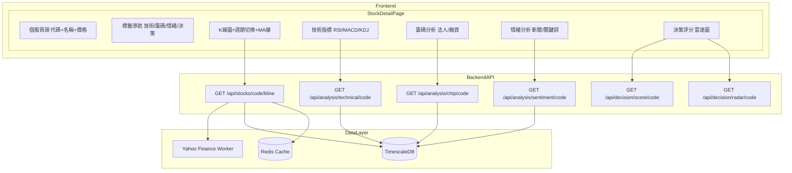
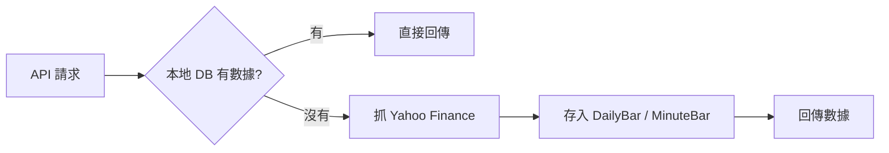
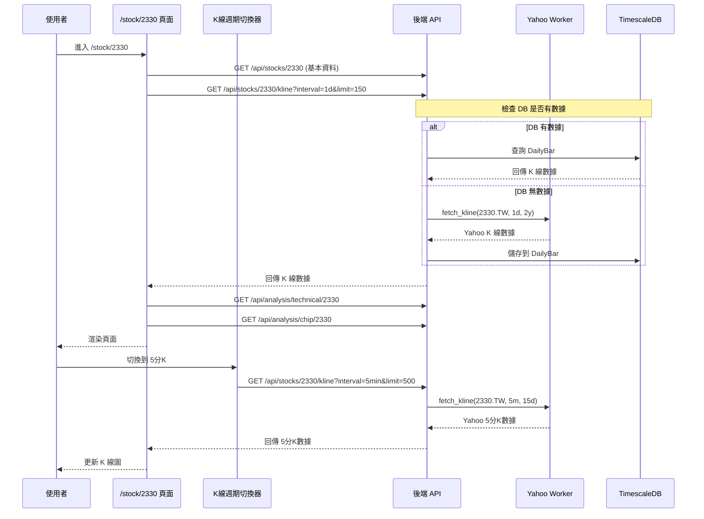

# 個股整合頁面 (/stock/{code}) 架構設計

## 1. 需求概述

建立 `/stock/{code}` 個股整合頁面，讓使用者一次看到該股票的：
- **K 線圖**（可切換日/週/月/分 K，支援 MA5/10/20/60/120）
- **技術分析**（RSI、MACD、KDJ、布林帶）
- **籌碼分析**（法人買賣超、融資融券、籌碼集中度）
- **情緒分析**（新聞 sentiment、關鍵詞）
- **決策評分**（綜合評分、雷達圖、操作建議）

## 2. 系統架構



## 3. 前端頁面結構

### 3.1 路由設計

```
frontend/src/app/stock/[code]/page.tsx       # 個股整合頁面（主入口）
```

### 3.2 頁面佈局

```
+----------------------------------------------------------+
|  [2330] 台積電  $580.00  +1.2%                           |
|  搜尋框 [________] [分析]                                |
+----------------------------------------------------------+
|  [技術分析] [籌碼分析] [情緒分析] [決策評分]              |  <-- Tab 切換
+----------------------------------------------------------+
|                                                          |
|  Tab 內容區域（根據選中的 Tab 顯示不同內容）               |
|                                                          |
+----------------------------------------------------------+
```

### 3.3 技術分析 Tab 內容

```
+----------------------------------------------------------+
|  週期切換: [日] [週] [月] [分K ▼]                        |
|  分K子選單: [1分] [3分] [5分] [15分] [30分] [60分]       |  (選分K時顯示)
+----------------------------------------------------------+
|                                                          |
|  K線圖 (CandlestickChart)                                |
|  - MA5 (藍) MA10 (橙) MA20 (紫) MA60 (紅) MA120 (綠)     |
|  - 技術標註（黃金交叉/死亡交叉/量價突破）                   |
|  - 懸停顯示 OHLCV 詳情                                   |
|                                                          |
+----------------------------------------------------------+
|  RSI 圖表    |    KDJ 圖表                               |
+----------------------------------------------------------+
|  MACD 圖表（全寬）                                       |
+----------------------------------------------------------+
|  詳細指標數值    |    K線決策分析                         |
|  - KDJ 數值     |    - MA排列分析                        |
|  - 布林帶       |    - RSI分析                           |
|  - 量價分析     |    - MACD訊號                          |
|                  |    - KDJ交叉訊號                       |
|                  |    - 綜合建議                          |
+----------------------------------------------------------+
```

### 3.4 籌碼分析 Tab 內容

```
+----------------------------------------------------------+
|  評分: 85/100  [買入]                                    |
+----------------------------------------------------------+
|  法人買賣超 (近5日)                                      |
|  [長條圖: 外資/投信/自營部]                               |
+----------------------------------------------------------+
|  融資融券 (近5日)                                        |
|  [長條圖: 融資餘額/融券餘額]                              |
+----------------------------------------------------------+
|  籌碼集中度    |    籌碼分析詳情                          |
|  - 集中度比    |    - 法人動向分析                        |
|  - 大戶趨勢    |    - 融資融券分析                        |
|  - 散戶比      |    - 集中度分析                          |
+----------------------------------------------------------+
```

### 3.5 情緒分析 Tab 內容

```
+----------------------------------------------------------+
|  評分: 75/100  [正面]                                    |
+----------------------------------------------------------+
|  新聞情緒分佈 (近5日)                                    |
|  [長條圖: 正面/中性/負面]                                 |
+----------------------------------------------------------+
|  熱門關鍵詞                                             |
|  [AI晶片] [先進製程] [營收成長] [外資買超] ...            |
+----------------------------------------------------------+
|  市場情緒    |    情緒分析詳情                            |
|  - 恐懼貪婪指數 |    - 新聞情緒分析                       |
|  - 整體情緒評分 |    - 市場情緒分析                       |
+----------------------------------------------------------+
```

### 3.6 決策評分 Tab 內容

```
+----------------------------------------------------------+
|  綜合評分: 85/100  [買入]                                |
+----------------------------------------------------------+
|  雷達圖（五維評分）    |    評分明細                      |
|  - 價值/動能/籌碼/    |    - 技術面: 80分                |
|    成長/抗跌          |    - 籌碼面: 85分                |
|                       |    - 基本面: 90分                |
|                       |    - 情緒面: 75分                |
+----------------------------------------------------------+
|  操作建議                                                   |
|  [繼續持有] TSMC 目前處於強勢多頭格局...                   |
+----------------------------------------------------------+
```

## 4. 後端 API 變更

### 4.0 歷史股價儲存策略

**核心原則**: 所有從 Yahoo 抓到的 K 線數據**必須存進資料庫**，避免重複抓取。



**儲存層級**:

| K 線類型 | 資料表 | 儲存長度 | 過期策略 | 更新頻率 |
|---|---|---|---|---|
| 日 K | DailyBar | 250-500 天 | 永久保留 | 每日盤後 |
| 週 K | DailyBar (聚合) | 2 年 | 永久保留 | 每週一 |
| 月 K | DailyBar (聚合) | 5 年 | 永久保留 | 每月1日 |
| 1 分 K | MinuteBar | 300-400 根 | 7 天過期 | 盤中即時 |
| 5 分 K | MinuteBar | 500 根 | 14 天過期 | 盤中即時 |
| 15 分 K | MinuteBar | 500 根 | 30 天過期 | 盤中即時 |
| 60 分 K | MinuteBar | 500 根 | 30 天過期 | 盤中即時 |

**實作方式**:

1. **日 K 線**: 修改 [`stocks.py`](backend/app/routers/stocks.py:241) 的 kline API，從 Yahoo 抓到的數據呼叫 `yahoo_worker.save_kline_data()` 存入 DailyBar
2. **分 K 線**: 新增 `save_minute_kline_data()` 存入 MinuteBar，過期數據自動清理
3. **週/月 K**: 不單獨儲存，由 DailyBar 即時聚合（效能足夠）

### 4.1 K 線 API 增強 (`/api/stocks/{code}/kline`)

**新增參數:**
- `interval`: K線週期
  - `1d` (日K, 預設)
  - `1w` (週K)
  - `1m` (月K)
  - `1min`, `3min`, `5min`, `15min`, `30min`, `60min` (分K)
- `limit`: 回傳筆數（預設 150，最大 500）

**Yahoo Finance 區間映射:**

| 前端 interval | Yahoo interval | Yahoo period | 說明 |
|---|---|---|---|
| 1d | 1d | 2y | 日K抓2年 |
| 1w | 1wk | 2y | 週K抓2年 |
| 1mo | 1mo | 2y | 月K抓2年 |
| 1min | 1m | 5d | 1分K抓5天 |
| 3min | 5m | 15d | 3分K用5m近似 |
| 5min | 5m | 15d | 5分K抓15天 |
| 15min | 15m | 1mo | 15分K抓1月 |
| 30min | 30m | 1mo | 30分K抓1月 |
| 60min | 60m | 1mo | 60分K抓1月 |

### 4.2 Yahoo Worker 變更

```python
# yahoo_worker.py 新增方法
async def fetch_kline(
    symbol: str,
    interval: str = "1d",    # Yahoo interval
    period: str = "2y",      # Yahoo period
    limit: int = 150         # 回傳筆數限制
) -> list[dict]:
    """統一 K 線抓取介面"""
```

### 4.3 現有 API 無需變更

以下 API 已存在且可直接使用：
- `GET /api/analysis/technical/{code}` - 技術分析
- `GET /api/analysis/chip/{code}` - 籌碼分析
- `GET /api/analysis/sentiment/{code}` - 情緒分析
- `GET /api/decision/score/{code}` - 評分
- `GET /api/decision/radar/{code}` - 雷達圖

## 5. 組件重構

### 5.1 CandlestickChart 組件更新

```typescript
// frontend/src/components/technical/CandlestickChart.tsx
interface Props {
  data: KLineData[];
  annotations?: TechnicalAnnotation[];
  maPeriods?: number[];        // 新增: 預設 [5, 10, 20, 60, 120]
  height?: number;
}

// MA 線顏色配置
const MA_COLORS = {
  5: "#3b82f6",    // 藍
  10: "#f59e0b",   // 橙
  20: "#8b5cf6",   // 紫
  60: "#ef4444",   // 紅
  120: "#22c55e",  // 綠
};
```

### 5.2 新增 K 線週期切換器組件

```typescript
// frontend/src/components/technical/KlinePeriodSelector.tsx
interface Props {
  value: string;
  onChange: (period: string) => void;
}

// 日 / 週 / 月 / 分K(下拉)
// 分K選項: 1分 / 3分 / 5分 / 15分 / 30分 / 60分
```

### 5.3 個股頁面 Tab 組件

```typescript
// frontend/src/components/stock/StockTabs.tsx
type TabKey = "technical" | "chip" | "sentiment" | "decision";

interface Props {
  activeTab: TabKey;
  onChange: (tab: TabKey) => void;
}
```

## 6. 資料流程



## 7. 實作順序

1. **後端: Yahoo Worker 統一 K 線抓取介面**
   - 重構 `fetch_chart_data` 為 `fetch_kline`
   - 支援多 interval/period 參數
   - 支援 limit 筆數限制

2. **後端: stocks API 支援多週期**
   - 新增 `limit` 參數
   - 擴充 `interval` 支援週/月/分 K
   - Yahoo interval 映射表

3. **前端: CandlestickChart 組件更新**
   - MA 線改為 [5, 10, 20, 60, 120]
   - 支援自訂 maPeriods prop
   - 更新圖例

4. **前端: K 線週期切換器組件**
   - 日/週/月/分K 按鈕
   - 分K 下拉選單
   - interval 映射

5. **前端: 建立 /stock/[code] 頁面**
   - 基本佈局（頁頭 + Tab 導航）
   - 技術分析 Tab（整合現有 technical/page.tsx 內容）
   - 籌碼分析 Tab（整合現有 chip/page.tsx 內容）
   - 情緒分析 Tab（整合現有 sentiment/page.tsx 內容）
   - 決策評分 Tab（整合現有 decision/page.tsx 內容）

6. **前端: 各 Tab 改為真實 API 數據**
   - 籌碼分析 Tab 串接 `/api/analysis/chip/{code}`
   - 情緒分析 Tab 串接 `/api/analysis/sentiment/{code}`
   - 決策評分 Tab 串接 `/api/decision/score/{code}` + `/api/decision/radar/{code}`

7. **Header 導航更新**
   - 新增「個股分析」連結（或從搜尋結果跳轉）

8. **測試與優化**
   - 各週期 K 線圖顯示測試
   - MA 線計算正確性驗證
   - 頁面載入效能優化（Tab 懶載入）

## 8. K 線形態識別引擎 (Candlestick Pattern Engine)

### 8.1 技術方案評估

| 方案 | 優點 | 缺點 | 建議 |
|---|---|---|---|
| **TA-Lib** | 內建 60+ 種形態函數，業界標準 | C 語言底層，Windows 安裝困難，Docker 部署複雜 | 不建議 |
| **Pandas 向量化** | 純 Python，易維護，效能足夠 | 需自行實作形態邏輯 | **推薦** |
| **混合方案** | TA-Lib 核心 + 自訂延伸 | 部署複雜度高 | 備選 |

**結論**: 採用 **Pandas 向量化運算** 實作形態辨識引擎，理由如下：
- 純 Python 生態，無 C 編譯依賴
- 向量化運算效能優於 if-else 迴圈（1000 根 K 線 < 10ms）
- 易於維護與延伸新形態
- 與現有 `TechnicalService` 架構一致（已使用 numpy）

### 8.2 數學定義基礎

所有形態判斷基於以下標準量化定義：

```
Body = |Close - Open|
Upper Shadow = High - max(Open, Close)
Lower Shadow = min(Open, Close) - Low
Total Range = High - Low
ATR_20 = 20日平均真實波幅（作為「大」與「小」的基準）
```

### 8.3 單根 K 線型態

| 型態 | 數學條件 | 訊號方向 | 評分影響 |
|---|---|---|---|
| **大紅K (Bullish Marubozu)** | Body > ATR_20 * 1.5 AND Close > Open AND Upper/Lower Shadow < Body * 0.1 | 多頭 | +8 |
| **大黑K (Bearish Marubozu)** | Body > ATR_20 * 1.5 AND Close < Open AND Upper/Lower Shadow < Body * 0.1 | 空頭 | -8 |
| **倒鎚線 (Inverted Hammer)** | Upper Shadow > Body * 2 AND Lower Shadow < Body * 0.5 AND 位於下跌趨勢 | 多頭反轉 | +5 |
| **墓碑線 (Gravestone Doji)** | Upper Shadow > Body * 2 AND Lower Shadow < Body * 0.5 AND 位於上漲趨勢 | 空頭反轉 | -5 |
| **鎚子線 (Hammer)** | Lower Shadow > Body * 2 AND Upper Shadow < Body * 0.5 AND 位於下跌趨勢 | 多頭反轉 | +5 |
| **吊人線 (Hanging Man)** | Lower Shadow > Body * 2 AND Upper Shadow < Body * 0.5 AND 位於上漲趨勢 | 空頭反轉 | -5 |
| **紡錘線 (Spinning Top)** | Body < ATR_20 * 0.5 AND Upper + Lower Shadow > Body * 2 | 盤整 | 0 |
| **十字線 (Doji)** | Body <= Total Range * 0.05 | 盤整/反轉訊號 | ±3（視趨勢） |
| **一字線 (Four-Price Doji)** | High == Low == Open == Close | 極端盤整 | 0 |

### 8.4 多根組合型態

| 型態 | 數學條件 | 訊號方向 | 評分影響 |
|---|---|---|---|
| **多頭吞噬 (Bullish Engulfing)** | Day1: 黑K AND Day2: 紅K AND Day2.Body > Day1.Body AND Day2.Open <= Day1.Close AND Day2.Close >= Day1.Open | 多頭反轉 | +10 |
| **空頭吞噬 (Bearish Engulfing)** | Day1: 紅K AND Day2: 黑K AND Day2.Body > Day1.Body AND Day2.Open >= Day1.Close AND Day2.Close <= Day1.Open | 空頭反轉 | -10 |
| **晨星 (Morning Star)** | Day1: 大黑K AND Day2: 小實體(下影) AND Day3: 大紅K AND Day3.Close > Day1.Close/2 | 多頭反轉 | +12 |
| **夜星 (Evening Star)** | Day1: 大紅K AND Day2: 小實體(上影) AND Day3: 大黑K AND Day3.Close < Day1.Close/2 | 空頭反轉 | -12 |
| **多頭孤島反轉 (Bullish Island)** | Day1-N: 下跌趨勢 AND Day(N+1): 向上跳空缺口 AND Day(N+2): 持續高於缺口 | 多頭反轉 | +15 |
| **空頭孤島反轉 (Bearish Island)** | Day1-N: 上漲趨勢 AND Day(N+1): 向下跳空缺口 AND Day(N+2): 持續低於缺口 | 空頭反轉 | -15 |

### 8.5 後端實作設計

```python
# backend/app/services/pattern.py
import numpy as np
import pandas as pd
from typing import List, Dict, Optional

class PatternService:
    """K線形態辨識服務"""
    
    # 形態強度權重
    PATTERN_WEIGHTS = {
        "marubozu_bull": 8,
        "marubozu_bear": -8,
        "inverted_hammer": 5,
        "gravestone": -5,
        "hammer": 5,
        "hanging_man": -5,
        "spinning_top": 0,
        "doji": 3,  # 可正可負，視趨勢而定
        "bullish_engulfing": 10,
        "bearish_engulfing": -10,
        "morning_star": 12,
        "evening_star": -12,
        "bullish_island": 15,
        "bearish_island": -15,
    }
    
    def __init__(self):
        pass
    
    def detect_all(self, bars: List[Dict]) -> List[Dict]:
        """
        偵測所有形態訊號
        
        Args:
            bars: K線數據列表，每筆包含 {date, open, high, low, close, volume}
        
        Returns:
            形態訊號列表，每筆包含 {pattern, direction, strength, date, index}
        """
        if len(bars) < 20:
            return []
        
        # 轉換為 pandas DataFrame 進行向量化運算
        df = pd.DataFrame(bars)
        
        # 計算基礎指標
        df['body'] = (df['close'] - df['open']).abs()
        df['upper_shadow'] = df['high'] - df[['open', 'close']].max(axis=1)
        df['lower_shadow'] = df[['open', 'close']].min(axis=1) - df['low']
        df['total_range'] = df['high'] - df['low']
        df['is_bull'] = df['close'] > df['open']
        df['atr_20'] = self._calculate_atr(df, 20)
        
        # 執行形態偵測
        patterns = []
        patterns.extend(self._detect_marubozu(df))
        patterns.extend(self._detect_hammer_family(df))
        patterns.extend(self._detect_doji(df))
        patterns.extend(self._detect_engulfing(df))
        patterns.extend(self._detect_star_patterns(df))
        patterns.extend(self._detect_island_reversal(df))
        
        return patterns
    
    def _calculate_atr(self, df: pd.DataFrame, period: int = 20) -> pd.Series:
        """計算 ATR (Average True Range)"""
        high_low = df['high'] - df['low']
        high_close = (df['high'] - df['close'].shift(1)).abs()
        low_close = (df['low'] - df['close'].shift(1)).abs()
        
        true_range = pd.concat([high_low, high_close, low_close], axis=1).max(axis=1)
        atr = true_range.rolling(window=period).mean()
        
        return atr
    
    def _detect_marubozu(self, df: pd.DataFrame) -> List[Dict]:
        """偵測大紅K/大黑K (Marubozu)"""
        patterns = []
        
        # 向量化判斷
        large_body = df['body'] > df['atr_20'] * 1.5
        small_shadow = (df['upper_shadow'] + df['lower_shadow']) < df['body'] * 0.1
        
        marubozu_mask = large_body & small_shadow
        
        for idx in df.index:
            if marubozu_mask[idx]:
                pattern_type = "marubozu_bull" if df['is_bull'].iloc[idx] else "marubozu_bear"
                patterns.append({
                    "pattern": pattern_type,
                    "direction": "bull" if pattern_type == "marubozu_bull" else "bear",
                    "strength": abs(self.PATTERN_WEIGHTS[pattern_type]),
                    "date": str(df['date'].iloc[idx]),
                    "index": idx
                })
        
        return patterns
    
    def _detect_hammer_family(self, df: pd.DataFrame) -> List[Dict]:
        """偵測鎚子線/倒鎚線/吊人線/墓碑線"""
        patterns = []
        
        # 長上影線形態 (倒鎚線/墓碑線)
        long_upper = df['upper_shadow'] > df['body'] * 2
        short_lower = df['lower_shadow'] < df['body'] * 0.5
        upper_shadow_pattern = long_upper & short_lower & (df['body'] > 0)
        
        # 長下影線形態 (鎚子線/吊人線)
        long_lower = df['lower_shadow'] > df['body'] * 2
        short_upper = df['upper_shadow'] < df['body'] * 0.5
        lower_shadow_pattern = long_lower & short_upper & (df['body'] > 0)
        
        for idx in df.index:
            if upper_shadow_pattern[idx]:
                # 判斷趨勢方向決定是倒鎚線(下跌中)還是墓碑線(上漲中)
                trend = self._get_trend(df, idx, lookback=10)
                if trend == "down":
                    patterns.append({
                        "pattern": "inverted_hammer",
                        "direction": "bull",
                        "strength": self.PATTERN_WEIGHTS["inverted_hammer"],
                        "date": str(df['date'].iloc[idx]),
                        "index": idx
                    })
                elif trend == "up":
                    patterns.append({
                        "pattern": "gravestone",
                        "direction": "bear",
                        "strength": abs(self.PATTERN_WEIGHTS["gravestone"]),
                        "date": str(df['date'].iloc[idx]),
                        "index": idx
                    })
            
            if lower_shadow_pattern[idx]:
                trend = self._get_trend(df, idx, lookback=10)
                if trend == "down":
                    patterns.append({
                        "pattern": "hammer",
                        "direction": "bull",
                        "strength": self.PATTERN_WEIGHTS["hammer"],
                        "date": str(df['date'].iloc[idx]),
                        "index": idx
                    })
                elif trend == "up":
                    patterns.append({
                        "pattern": "hanging_man",
                        "direction": "bear",
                        "strength": abs(self.PATTERN_WEIGHTS["hanging_man"]),
                        "date": str(df['date'].iloc[idx]),
                        "index": idx
                    })
        
        return patterns
    
    def _detect_engulfing(self, df: pd.DataFrame) -> List[Dict]:
        """偵測吞噬型態 (Engulfing)"""
        patterns = []
        
        for i in range(1, len(df)):
            prev = df.iloc[i-1]
            curr = df.iloc[i]
            
            # 多頭吞噬: 前黑後紅，且今日實體完全吞噬昨日實體
            if (prev['close'] < prev['open'] and  # 昨日黑K
                curr['close'] > curr['open'] and  # 今日紅K
                curr['open'] <= prev['close'] and  # 今日開盤 <= 昨日收盤
                curr['close'] >= prev['open']):    # 今日收盤 >= 昨日開盤
                patterns.append({
                    "pattern": "bullish_engulfing",
                    "direction": "bull",
                    "strength": self.PATTERN_WEIGHTS["bullish_engulfing"],
                    "date": str(df['date'].iloc[i]),
                    "index": i
                })
            
            # 空頭吞噬: 前紅後黑，且今日實體完全吞噬昨日實體
            elif (prev['close'] > prev['open'] and
                  curr['close'] < curr['open'] and
                  curr['open'] >= prev['close'] and
                  curr['close'] <= prev['open']):
                patterns.append({
                    "pattern": "bearish_engulfing",
                    "direction": "bear",
                    "strength": abs(self.PATTERN_WEIGHTS["bearish_engulfing"]),
                    "date": str(df['date'].iloc[i]),
                    "index": i
                })
        
        return patterns
    
    def _get_trend(self, df: pd.DataFrame, idx: int, lookback: int = 10) -> str:
        """判斷短期趨勢方向"""
        if idx < lookback:
            return "unknown"
        
        recent_closes = df['close'].iloc[idx-lookback:idx]
        if recent_closes.iloc[-1] > recent_closes.iloc[0] * 1.02:
            return "up"
        elif recent_closes.iloc[-1] < recent_closes.iloc[0] * 0.98:
            return "down"
        return "flat"
    
    def get_pattern_score(self, patterns: List[Dict], lookback: int = 5) -> int:
        """
        計算近期形態評分（用於決策樹）
        
        Args:
            patterns: 形態訊號列表
            lookback: 回看最近 N 根 K 線的形態
        
        Returns:
            形態評分（-100 ~ +100）
        """
        if not patterns:
            return 0
        
        # 只取最近的形態訊號
        recent = sorted(patterns, key=lambda x: x['index'], reverse=True)[:lookback]
        
        score = sum(
            p['strength'] if p['direction'] == 'bull' else -p['strength']
            for p in recent
        )
        
        return max(-100, min(100, score))
```

### 8.6 整合進決策樹評分系統

```python
# backend/app/services/scoring.py 修改

async def calculate_composite_score(self, stock_code: str) -> dict:
    """多因子綜合評分 - 新增 K 線形態因子"""
    
    # 現有維度
    technical = await self.tech_service.analyze(stock_code, "medium")
    chip = await self.chip_service.analyze(stock_code, 90)
    sentiment = await self.sentiment_service.analyze(stock_code, 7)
    industry = await self.industry_service.analyze(stock_code, 30)
    
    # 新增: K 線形態分析
    pattern_service = PatternService()
    bars = await self.tech_service._fetch_bars(stock_code, days=120)
    patterns = pattern_service.detect_all(bars)
    pattern_score = pattern_service.get_pattern_score(patterns)
    
    # 更新權重分配（總和仍為 1.0）
    WEIGHTS = {
        "technical": 0.25,      # 原 0.30，釋出 0.05 給形態
        "chip": 0.25,           # 原 0.30，釋出 0.05 給形態
        "fundamental": 0.20,
        "sentiment": 0.20,
        "pattern": 0.10,        # 新增: K線形態佔 10%
    }
    
    # 形態分數轉換為 0-100 區間
    pattern_norm = (pattern_score + 100) / 2  # -100~100 -> 0~100
    
    total_score = (
        technical.get("score", 50) * WEIGHTS["technical"]
        + chip.get("score", 50) * WEIGHTS["chip"]
        + industry.get("score", 50) * WEIGHTS["fundamental"]
        + sentiment.get("score", 50) * WEIGHTS["sentiment"]
        + pattern_norm * WEIGHTS["pattern"]
    )
    
    return {
        ...,
        "pattern_score": pattern_score,
        "patterns_detected": patterns,
        "weights": WEIGHTS,
    }
```

### 8.7 前端形態標註

```typescript
// frontend/src/components/technical/CandlestickChart.tsx
// 新增形態標註渲染

interface PatternAnnotation {
  index: number;
  pattern: string;
  direction: "bull" | "bear";
  position: "top" | "bottom";
}

// 形態圖示配置
const PATTERN_ICONS: Record<string, { icon: string; color: string }> = {
  "marubozu_bull": { icon: "🔴", color: "#ef4444" },
  "marubozu_bear": { icon: "⚫", color: "#000000" },
  "hammer": { icon: "🔨", color: "#22c55e" },
  "hanging_man": { icon: "🔨", color: "#ef4444" },
  "inverted_hammer": { icon: "⛏️", color: "#22c55e" },
  "gravestone": { icon: "⛏️", color: "#ef4444" },
  "bullish_engulfing": { icon: "📈", color: "#22c55e" },
  "bearish_engulfing": { icon: "📉", color: "#ef4444" },
  "morning_star": { icon: "⭐", color: "#22c55e" },
  "evening_star": { icon: "⭐", color: "#ef4444" },
};
```

## 9. 實作順序（更新）

1. ✅ **後端: K 線形態辨識引擎**
   - ✅ 建立 `backend/app/services/pattern.py`
   - ✅ 實作 ATR 計算（向量化）
   - ✅ 實作單根 K 線形態偵測（Marubozu, Hammer, Doji...）
   - ✅ 實作多根組合形態偵測（Engulfing, Star, Island）
   - ✅ 實作形態評分函數

2. ✅ **後端: 決策樹整合 K 線形態**
   - ✅ 修改 `scoring.py` 新增形態因子
   - ✅ 調整各維度權重
   - ✅ 更新 API 回傳結構

3. ✅ **後端: Yahoo Worker 統一 K 線抓取介面**
   - ✅ 重構 `fetch_chart_data` 為 `fetch_kline`
   - ✅ 支援多 interval/period 參數
   - ✅ 支援 limit 筆數限制

4. ✅ **後端: stocks API 支援多週期**
   - ✅ 新增 `limit` 參數
   - ✅ 擴充 `interval` 支援週/月/分 K
   - ✅ Yahoo interval 映射表

5. ✅ **前端: CandlestickChart 組件更新**
   - ✅ MA 線改為 [5, 10, 20, 60, 120]
   - ✅ 支援自訂 maPeriods prop
   - ✅ 新增形態標註渲染
   - ✅ 更新圖例

6. ✅ **前端: K 線週期切換器組件**
   - ✅ 日/週/月/分K 按鈕
   - ✅ 分K 下拉選單
   - ✅ interval 映射

7. ✅ **前端: 建立 /stock/[code] 頁面**
   - ✅ 基本佈局（頁頭 + Tab 導航）
   - ✅ 技術分析 Tab（整合現有 technical/page.tsx 內容）
   - ✅ 籌碼分析 Tab（整合現有 chip/page.tsx 內容）
   - ✅ 情緒分析 Tab（整合現有 sentiment/page.tsx 內容）
   - ✅ 決策評分 Tab（整合現有 decision/page.tsx 內容）

8. ✅ **前端: 各 Tab 改為真實 API 數據**
   - ✅ 籌碼分析 Tab 串接 `/api/analysis/chip/{code}`
   - ✅ 情緒分析 Tab 串接 `/api/analysis/sentiment/{code}`
   - ✅ 決策評分 Tab 串接 `/api/decision/score/{code}` + `/api/decision/radar/{code}`

9. ✅ **Header 導航更新**
   - ✅ 新增「個股分析」連結（或從搜尋結果跳轉）

10. ⏳ **測試與優化**
    - ⏳ K 線形態辨識正確性驗證（對照歷史數據）
    - ⏳ 各週期 K 線圖顯示測試
    - ⏳ MA 線計算正確性驗證
    - ⏳ 頁面載入效能優化（Tab 懶載入）

## 10. 注意事項

- **Yahoo Finance 限制**: Yahoo 不支援 3 分 K，用 5 分 K 近似
- **快取策略**: K 線數據快取 5 分鐘（分 K）/ 30 分鐘（日 K）
- **效能**: 個股頁面一次載入多個 API，考慮使用 `Promise.all` 並行請求
- **Tab 懶載入**: 可考慮用 `React.lazy` 懶載入各 Tab 內容，減少初始載入時間
- **現有頁面保留**: `/technical`, `/chip`, `/sentiment`, `/decision` 頁面保留，但可考慮導向 `/stock/{code}`
- **形態辨識效能**: Pandas 向量化運算 1000 根 K 線 < 10ms，無需額外快取
- **形態訊號頻率**: 建議只標註最近 5 根 K 線內的形態，避免圖表過於雜亂
